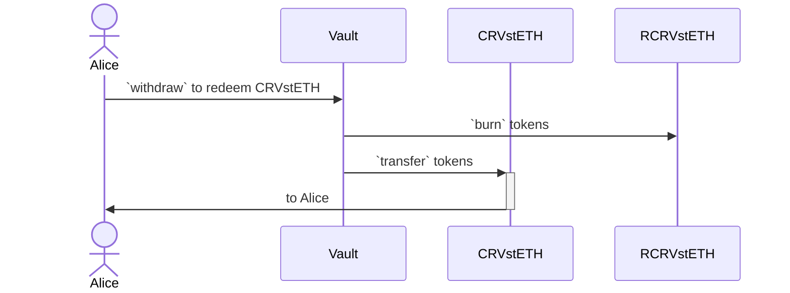

# AutoCompound Vault

## Overview

This is a vault that autocompound the yield when deposited.

### Architecture

Here is the user workflow to **deposit** token into Vault:


---

Here is the user workflow to **redeem** deposited token from Vault:



For calculation (simulated), refer to this [excel](./docs/VaultRecord.xlsx).

## Usage

This is a list of the most frequently needed commands.

### Build

Build the contracts:

```sh
$ forge build
```

### Clean

Delete the build artifacts and cache directories:

```sh
$ forge clean
```

### Coverage

Get a test coverage report:

```sh
$ forge coverage
```

### Deploy

Deploy to Anvil:

```sh
$ forge script script/DeployFoo.s.sol --broadcast --fork-url http://localhost:8545
```

For this script to work, you need to have a `MNEMONIC` environment variable set to a valid
[BIP39 mnemonic](https://iancoleman.io/bip39/).

For instructions on how to deploy to a testnet or mainnet, check out the
[Solidity Scripting](https://book.getfoundry.sh/tutorials/solidity-scripting.html) tutorial.

### Format

Format the contracts:

```sh
$ forge fmt
```

### Gas Usage

Get a gas report:

```sh
$ forge test --gas-report
```

### Lint

Lint the contracts:

```sh
$ pnpm lint
```

### Test

Run the tests:

```sh
$ forge test
```

## License

This project is licensed under MIT.
