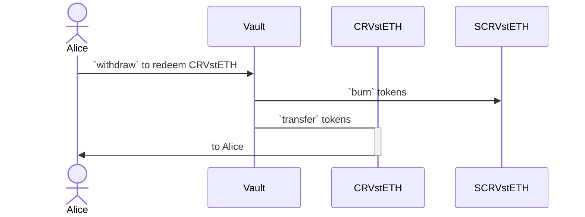

# AutoCompound Vault

## Overview

This is a vault that autocompound the yield when deposited.

> Stake Amount & Deposit Amount are used synonymously.
>
> Shares Amount & Receipt Amount are used synonymously.
>
> Redeemable Amount is calculated during redeeming i.e. `redeem` function. Here, the deposited amount can't be withdrawn unlike in a simple vault (without auto-compounding yield). Here, the deposited amount can only be redeemed by giving back the receipt tokens.

To deploy the contract with an APY of 0.1% (0.001 in decimal representation) per day, you would use the following value as the constructor argument:

```
0.001 * 10^18 = 1000000000000000
```

In the FE UI, the value would be fed in wei, which is 18 decimal places. User might write 0.1% as 0.1, but it is fed as `0.001 * 1e18` in the contract.

---

It is assumed that whenever someone deposits into the vault, the vault will automatically compound the yield based on the APY set during deployment.

> Suppose, if someone stakes token for a month, still the accrued yield will be compounded for the whole month.

---

`CRV:stETH` Deposit Token is generally a LP Token of `CRV:stETH` Pool. And it is based on ERC20 standard. But, we created a mock `DepositToken.sol` for testing purpose.

- `IDepositToken.sol` is publicly available.

### Architecture

Here is the user workflow to **deposit** token into Vault:


---

Here is the user workflow to **redeem** deposited token from Vault:



For calculation (simulated), refer to this [excel](./docs/VaultRecord.xlsx).

## Usage

This is a list of the most frequently needed commands.

### Build

Build the contracts:

```sh
$ forge build
```

### Clean

Delete the build artifacts and cache directories:

```sh
$ forge clean
```

### Coverage

Get a test coverage report:

```sh
$ forge coverage
```

### Deploy

Deploy to Anvil:

```sh
$ forge script script/DeployFoo.s.sol --broadcast --fork-url http://localhost:8545
```

For this script to work, you need to have a `MNEMONIC` environment variable set to a valid
[BIP39 mnemonic](https://iancoleman.io/bip39/).

For instructions on how to deploy to a testnet or mainnet, check out the
[Solidity Scripting](https://book.getfoundry.sh/tutorials/solidity-scripting.html) tutorial.

### Format

Format the contracts:

```sh
$ forge fmt
```

### Gas Usage

Get a gas report:

```sh
$ forge test --gas-report
```

### Lint

Lint the contracts:

```sh
$ pnpm lint
```

### Test

Run the tests:

```sh
$ forge test
```

## License

This project is licensed under MIT.
