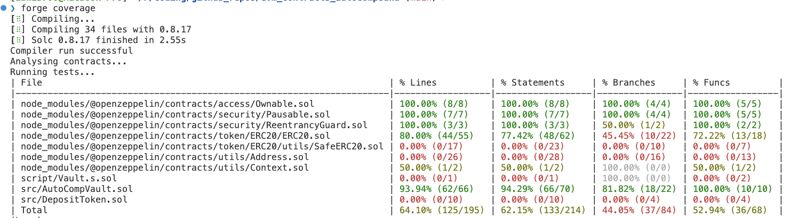

# Test Coverage Report

It looks like this:

> Corresponding to `AutoCompoundVault.sol` in the `contracts` directory, the percentage is not 100% because some of the checks inside the function can be skipped as those are output sanitization checks. Can't be done externally.
